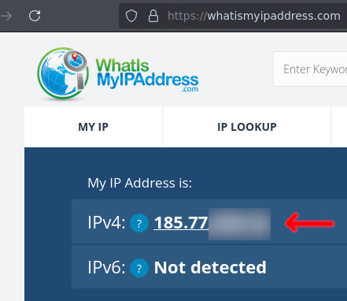
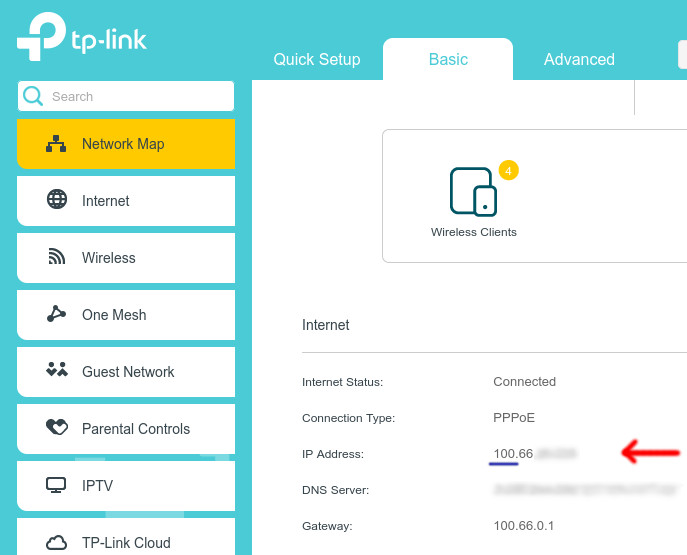
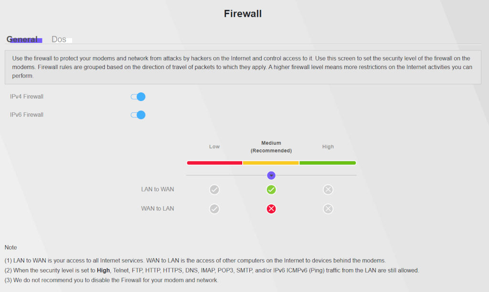

# Network Troubleshooting Guide

C&C Online can offer some of the most engaging and rewarding experiences—whether you're teaming up with friends for co-op or competing in a 2v2 match online. However, smooth online play depends heavily on stable and reliable network connections. Inconsistent latency, dropped connections, and server issues can quickly turn a fun session into a frustrating one.

This guide is designed to help players diagnose and resolve common network-related problems that may arise when trying to connect to multiplayer services across the Command & Conquer titles supported by the C&C Online service.

These games were released a long time ago; therefore, some problems tend to come up in modern networking environments. Problems can range from not being able to connect to the servers to failing to join lobbies or start a multiplayer game, and, unfortunately, each issue can have multiple causes, making the troubleshooting process complicated.

Please read through all of the sections in order, and try all the troubleshooting methods before reaching out to the support team, as this will allow us to pinpoint edge cases and unknown issues and focus our effort more effectively.

### Preliminary Considerations

The games supported by our service are:

* Command & Conquer: Generals
* Command & Conquer: Generals: Zero Hour 
* Command & Conquer 3: Tiberium Wars
* Command & Conquer 3: Kane's Wrath
* Command & Conquer: Red Alert 3

These titles may henceforth be referred to by the acronyms `CCG`, `ZH`, `TW`, `KW`, and `RA3` respectively.

The very first thing you need to make sure of is that our client, Tacitus, is correctly installed (you can do this by following the installation guide provided here). A very important note is that Generals and Zero Hour *DO NOT* use the Tacitus client for their online functionality. For them you have to use the utility called **Gentool**.

It is noteworthy that most of the online connectivity guides out there are either dated (e.g. advising people to hook the game which is the process used by the old C&C Online Launcher that got replaced with Tacitus) or just plain wrong (e.g. advising people to forward ports that are not used by the game). So it is important to start with a clean slate, and follow the instructions provided here to maximize your chance of success in troubleshooting.

### IPv4 Requirement, Carrier-Grade NAT (CG-NAT) and P2P Connectivity

Given the old age of these games, they do not natively support IPv6. They require the user to have a `net-reachable IPv4` address assigned to them by their ISP. Therefore if your ISP is strictly giving you an IPv6 address, the only options left for you are to either use a VPN or contact your ISP and ask them to assign an IPv4 for you. None of the other methods and tips provided below will help you.

Checking whether you have an IPv4 assigned to you is actually very easy. Just visit one of the websites that show you your IP address (e.g. [this site](https://whatismyipaddress.com) or just google for another website), and check if you can see an IPv4 value.

All of the games supported by us establish peer-to-peer (P2P) connections for their multiplayer, and the central server is only used to allow the players to find each other. The only protocol the games use for P2P is UDP, and they do UDP Hole Punching for NAT Traversal. This means that most players will not need any form of port forwarding or DMZ, as the games correctly negotiates their inbound ports. Also note that our games DO NOT negotiate their port forwardings through UPnP, so it being enabled or disabled has no effect on the connectivity (unless you use an 3rd-party UPnP client and use a static port which is taught in this guide later on).

In some cases, players may experience difficulty establishing P2P connections due to the use of Carrier-Grade NAT (CG-NAT) on their internet connection (also called DS-Lite in some configurations). CG-NAT is commonly used by ISPs to conserve IPv4 addresses by assigning multiple customers a shared external IP address. While this approach helps manage limited IP resources, it introduces limitations that can interfere with direct inbound connections—an essential requirement for many P2P-based multiplayer systems.

If the ISP's CG-NAT implementation is not NAT traversal (NAT-T) capable (meaning it doesn't support UDP hole punching), players behind it will often be unable to host or directly connect to other players. This can result in connection timeouts, failure to join lobbies or start games, or unstable gameplay sessions. In essence, the network is unable to negotiate a direct path between peers, breaking the core mechanism that P2P multiplayer depends on.

You can check whether you are behind a CG-NAT by following this procedure:

1) Log into your modem/router.
2) Usually the very first page that comes up shows your connection information (otherwise look for a network status page). You can find the IPv4 assigned to you there.
3) If the IP starts with `10`, `192`, `172`, or `100` (which differs from your external IP which you found earlier in the guide), then you are behind a CG-NAT.

In environments where CG-NAT is present and cannot be bypassed, using a VPN that supports port forwarding, requesting a public IP from the ISP, switching to a different type of connection (such as fiber or business-class broadband), or in some rare cases port forwarding or DMZ is required to restore full multiplayer functionality.

The limitations outlined here for the ISPs also apply for VPNs, therefore not all VPNs work (meaning they must give the user an external IPv4, not just an IPv6, and support port forwarding). It is necessary to test the VPN connection as well using the tools provided below to make sure they have forwarding capabilities.

### Restrictive Networks

In some regions or network environments, users may encounter connectivity issues caused not by their local devices or settings, but by broader network restrictions imposed by ISPs, corporations, or government policies. These restrictions can deliberately or inadvertently interfere with multiplayer functionality by blocking specific ports, protocols, or entire classes of peer-to-peer traffic.

For example, some ISPs or firewalls block TCP port 6667, which is traditionally used for IRC traffic, due to concerns over command-and-control traffic or legacy abuse cases. Although our multiplayer service may not rely on the IRC protocol, this port is shared by our service for providing the chat/lobby system. More critically, certain countries or networks block UDP hole punching—an essential technique for peer-to-peer connection setup—to restrict applications like VoIP or SIP, often as part of broader efforts to control or surveil communications.

In corporate or institutional environments, strict firewall policies may restrict all unsolicited inbound or outbound traffic, effectively preventing any form of direct multiplayer connection.

If you're experiencing consistent connection issues on a managed or national network, we recommend testing connectivity from a more open network (such as a mobile hotspot), or using a VPN known to bypass these restrictions. Unfortunately, due to the evolving nature of network policy enforcement, reliable connectivity may not always be possible without user-side configuration or third-party tools.

### Firewall

The installers for these games usually add the required exceptions to the firewall, or if you were prompted inside the game when connecting to the online service, you should've allowed the game through the firewall. Please make sure that your firewall solution is not blocking the games.

### Edge Case: Blockage of TCP port 6667

NOTE: This error usually manifests itself in not being able to log in or logging in and the lobby not loading up. If you're past this step and getting a `Failed Connection 1-2`, this port is not the problem.

1) Start the game.
2) Open the Tacitus overlay, by pressing its hotkey `Ctrl+T`.
3) Go to the `Network` tab in the overlay.
4) Enable the `UseAltPeerChatPort` option.
5) Press `Save` and use `Ctrl+T` to close the overlay.
6) Try logging in again, to see if the issue is resolved.

### Edge Case: Red Alert 3 Firewall Port Override

There is a setting in Red Alert 3, which is known to cause problems for setting up multiplayer games (the error is usually a `Failed Connection 1-2`). This is caused by setting a static Port Number in the game's settings under the Network section. Unfortunately just removing the port does not resolve the issue, and its directive must be manually removed from the game's options file.

1) Make sure that the game is closed.
2) Inside the Start menu or your file explorer navigate to `%appdata%`. Then to the `Red Alert 3` folder and then to `Profiles`. The full path is `%appdata%\Red Alert 3\Profiles`, which when expanded looks something like this: `C:\Users\your_username\AppData\Roaming\Red Alert 3\Profiles\`
3) Open the `Options.ini` file.
4) Find the line inside the file that starts with `FirewallPortOverride` and delete the entire line.
5) Save the file and close it.
6) Start the game and test the multiplayer functionality.

### Checking for Blockage of Port Forwarding (UDP Hole Punching)

To help players troubleshoot peer-to-peer (P2P) connectivity issues, we provide a set of diagnostic tools designed to test whether your network environment supports the protocols and connection techniques used by our multiplayer service.

These tools simulate real-world connection attempts between peers and measure how your network responds to outbound and inbound UDP traffic. By doing so, they can detect whether your router, firewall, or ISP is allowing the types of connections required for smooth P2P gameplay.

We strongly encourage players experiencing frequent connection failures or hosting issues to run these tools before going for the other more complicated methods.

It is also very important to remember, that if two people are failing to connect to each other, the issue might be with just one user and not the other. Always test your connectivity with people who are known to have correct working connection (you can ask the tech support staff for a test). This will allow the players to pinpoint directly which user has connectivity issues.

It is worth mentioning, that these tools can also be used to test whether a VPN provider supports the connectivity features required by the games. So if you want to give a VPN provider, which isn't tested by us, a try, you can use these tools to test them.

There are currently two options:

The first option is our classic `NatNegTest` tool, which can be downloaded from [here](assets/for/network-troubleshooting-guide.en/NatNegTest.rar) or [here](http://server.cnc-online.net/downloads/NATNegTest.rar). Extract it into a folder and double-click on the `.bat` file (Make sure the files are extracted, as you can't run the test utility directly from the compressed file). If the tool fails to run, please download and install this [runtime](https://www.microsoft.com/en-us/download/details.aspx?id=40784). Note that if you have previously enabled port forwarding or DMZ inside your modem/router, then disable them first before testing (you can test with them enabled as well later on, but be sure to test without them first).

The second option is the `WarpPort` tool, which can be downloaded from [here](https://warpport.kaneswrath.com). This tool provides multiple tests, but the only tests you need to do are the `Hole Punch Test` and the `Peer-to-Peer Test`. It is noteworthy that the `Peer-to-Peer Test`, requires both players to have the tool installed, in order to run the test. There is an instructional video available on the provided link, that teaches you how to run these two tests.

### Correct In-game IP Setting

For users that have multiple active network adapters on their system (this also happens when the user has activated a VPN connection), the games might fail to detect the correct network interface. To fix this, you can navigate to the in-game settings, and go to the Network section. There is a drop-down menu allowing you to select the IP of the desired interface. Make sure you select the right IP address. Note that the IP addresses listed here are the interfaces' local IP addresses, not their external ones (the internet connection interface usually has an IP that starts with `192`).

If you have activated a VPN interface, you must select the VPN adapters local IP from this list.

In this section, there is also an option called `Send Delay`. It was originally designed to help with some D-Link and Netgear modems/routers, but we have observed it helping with situations involving different connection issues as well.

**NOTE:** There is a rare edge-case, where the presence of a virtual network adapter on the system, that is disconnected but not disabled prevents the game from doing NAT traversal correctly. In our tests, Port Forwarding solved this problem, but the better approach is to disable the adapter when it's not needed. Selecting the correct in-game IP address from the settings might also remedy this problem.

### How to Fix the Connectivity Issues

If the diagnostic tools inform you of having a connectivity issue, you *may* be able to resolve it by using one of the methods below. The most consistent and also the easiest solution is to use a VPN. You can check our VPN guide for instructions on how to set it up.

In some **rare cases** (some CG-NAT configurations), users might resolve their issue by configuring Port Forwarding or DMZ inside their modems/routers. Port Forwarding is generally a better option than DMZ. If you choose to give this method a try, the ranges you have to forward are listed below for each game:

* TW & KW: 8088 to 65534 UDP
* RA3: 6500 to 65534 UDP
* CCG & ZH: 4321 to 65534 UDP

It is not just two ports, but the entire range of ports. The reason the ranges are so large is that the port selected by the game for each peer is one random UDP port. In ALL of our tests, the selected port was in the five digits (meaning higher than 10000), but we haven't reversed the port selection logic of the games.

It is possible to set a static port inside the Network section of the in-game settings and only forward that single UDP port. This is known to work for TW/KW/CCG/ZH. **HOWEVER DO NOT SET THIS OPTION FOR RED ALERT 3** (if you did, use the `Red Alert 3 Firewall Port Override` section in this guide to remove the offending option).

**NOTE:** We've discovered a rare edge case. In the case when both users are behind CG-NAT (NAT-T capable), it is possible for TW/KW/RA3 to work without a VPN and for CCG/ZH to require a VPN (this might be due to discrepancies in the netcodes of the games).

### Edge Case: Router Firewall Settings

If you're wondering why other guides list certain ports to be forwarded, those are the destination ports that game clients connect **TO** on the C&C Online servers. You do not need to forward these ports, as the connections are outbound, not inbound.

In rare cases—such as when a firewall blocks all outbound traffic except for explicitly allowed ports—you may need to manually permit those destination ports through the firewall. For example, one user's *modem* had a built-in firewall with preset security levels (low/medium/high). When set to high, the firewall operated in a "block all, allow some" mode, which prevented outbound connections to ports like TCP 28900. In this scenario, manually forwarding the ports on the router effectively signaled the firewall to allow traffic to or from those ports.

However, the correct and recommended solution in such cases is to lower the firewall setting to medium, rather than relying on port forwarding to circumvent outbound filtering.

### Nothing mentioned here worked?

If none of the advice provided above solved your issue, please join our [community Discord server](contact-us.en.md) and create a `tech-support` ticket. Please document all of the steps you've taken and the results you've seen so far and provide them in your ticket.

### Found a new solution?

Also if you managed to discover a new solution for the networking issues in these games, please don't shy away from contacting the tech support staff in the [community Discord](contact-us.en.md).

---

*Last Modified: 5 July 2025*

*Credits:* 

* [Cervanthes](https://github.com/STK0Cervanthes) (the original network troubleshooting guides that got adapted into the current guide)
* [YourHorse](https://github.com/YourHorse1) (researching the network connectivity approach of the games and also the creation of WarpPort)
* [Astra](https://github.com/astra1993) (organizing knowledge and writing this guide)