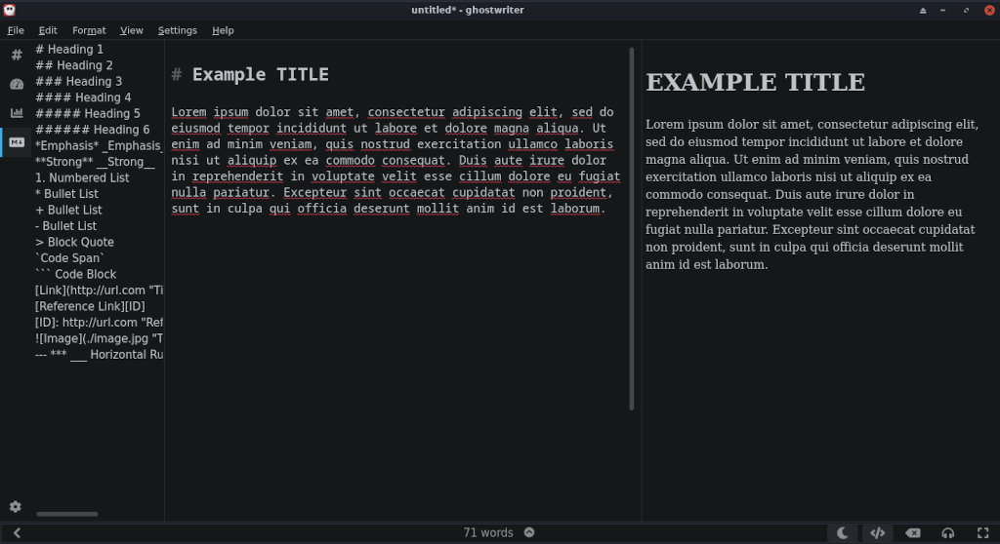

# How to write a guide using Ghostwriter

Writing a technical guide requires clarity, consistency, and ease of navigation. The final format of our documentation is `Markdown`. Markdown is a lightweight markup language that makes formatting fast and distraction-free. You can use any markdown editor you prefer, as long as the links to the images you insert are relative links. We suggest Ghostwriter as it is free, fast, and offline. Ghostwriter is a versatile, cross-platform, open-source Markdown editor that helps writers stay focused while leveraging useful features like syntax highlighting, live preview, and distraction-free writing modes. Try to make your guide as novice-friendly as possible, and where applicable, add relevant screenshots, examples, and step-by-step instructions.

### Installing Ghostwriter

You can download and install Ghostwriter from [here](https://ghostwriter.kde.org/download/).



### Directory structure of a guide

After selecting an appropriate name for your guide (only use lowercase letters, numbers, and dashes), create a folder named after your guide inside the `assets/for/` directory placed relative to your guide. Adding a two-letter language tag to the file is preferred. For example, if the guide is called **Test Guide**, we'll choose the tag name `test-guide` and the files we create would resemble something like this:

```
.
├── assets
│   └── for
│       └── test-guide.en
│           ├── 1.jpg
│           ├── 2.jpg
│           └── 3.png
└── test-guide.en.md
```


### Adding images in Ghostwriter

Unlike Google Docs, Ghostwriter inserts images using relative paths, so it eases the writing process overall. Putting the guide's file relative to the assets folder causes all the image links to be correct in the final document.

### Markdown syntax

Although Ghostwriter provides a WYSIWYG environment, formatting shortcuts, and a markdown cheatsheet, if you'd like to learn more about markdown's syntax , check [this website](https://www.markdownguide.org).

---

*Last Modified: 7 June 2025*

*Credits: [Astra](https://github.com/astra1993)*
