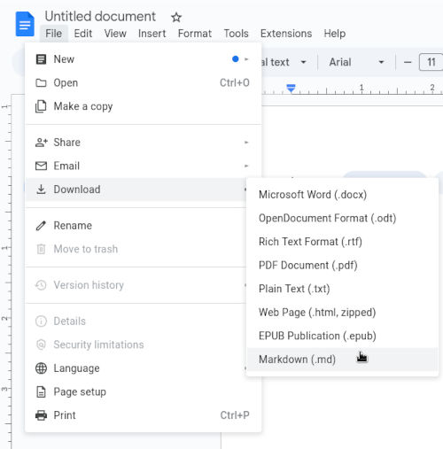

# How to write a guide using Google Docs

Writing a technical guide requires clarity, consistency, and ease of navigation. Google Docs is a versatile tool for creating technical documentation, as it offers a wide variety of features and a graphical interface that streamline the writing and collaboration process. Note that the final format of our documentation is `Markdown`, so writers have to take some caveats of working with Google Docs into account and work around them. Try to make your guide as novice-friendly as possible, and where applicable, add relevant screenshots, examples, and step-by-step instructions.

### Directory structure of a guide

After selecting an appropriate name for your guide (only use lowercase letters, numbers, and dashes), create a folder named after your guide inside the `assets/for/` directory placed relative to your guide (in the Google Docs method, you'll download the finalized Markdown file and put it here). Adding a two-letter language tag to the file is preferred. For example, if the guide is called **Test Guide**, we'll choose the tag name `test-guide` and the files we create would resemble something like this:

```
.
├── assets
│   └── for
│       └── test-guide.en
│           ├── 1.jpg
│           ├── 2.jpg
│           └── 3.png
└── test-guide.en.md
```


### Exporting your guide to Markdown

After you've completed your guide, you can export the document in the Markdown format, by going to `File > Download > Markdown (.md)`. Remember that you must include all of your assets, such as images, when submitting your guide.



### Adding images in Google Docs

When exporting to Markdown, Google Docs often embeds images as base64 data urls. This is not desirable for our purposes, because of Github's environment, and the images will fail to show up in there. Therefore when creating your guide inside Google Docs, type memorable tags in place of the images (e.g. `<first image>` or `<1.jpg>`), and replace them later, by creating the directory structure explained above, and linking the images using relative paths in the Markdown syntax. For example:  
``

---

*Last Modified: June 6th, 2025*

*Credits: [Astra](https://github.com/astra1993)*